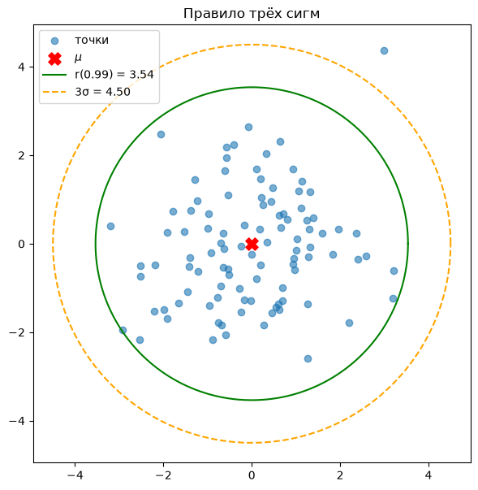
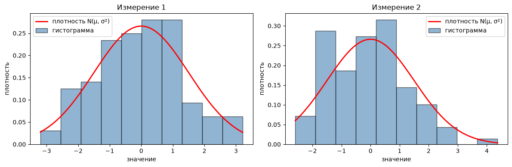
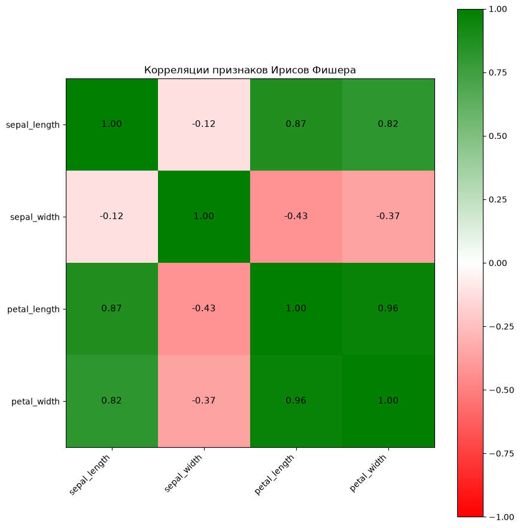
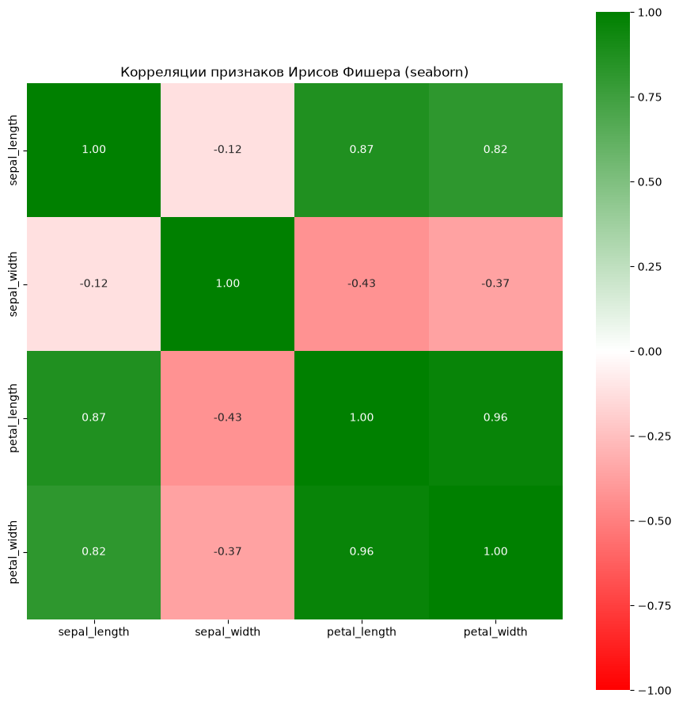

# Лабораторная работа 2. Пакет Matplotlib

## Задание 1 (1 балл)


```python
import numpy as np
import matplotlib.pyplot as plt

# фиксируем seed для воспроизводимости
rng = np.random.default_rng(42)

mu = np.array([0.0, 0.0])       # среднее
sigma = 1.5                      # СКО

# 100 точек размерности 2
points = rng.normal(loc=mu, scale=sigma, size=(100, 2))

# расстояния от центра
dist = np.linalg.norm(points - mu, axis=1)

# радиус, на который приходится 0.99 точек
r99 = np.quantile(dist, 0.99)
r3s = 3 * sigma

fig, ax = plt.subplots(figsize=(7, 7))
ax.scatter(points[:, 0], points[:, 1], alpha=0.6, label='точки')
ax.scatter(*mu, color='red', s=120, marker='X', zorder=5, label=r'$\mu$')

# окружность радиуса r99
theta = np.linspace(0, 2*np.pi, 400)
ax.plot(mu[0] + r99*np.cos(theta), mu[1] + r99*np.sin(theta),
        color='green', label=f'r(0.99) = {r99:.2f}')
# окружность 3 сигмы
ax.plot(mu[0] + r3s*np.cos(theta), mu[1] + r3s*np.sin(theta),
        color='orange', linestyle='--', label=f'3σ = {r3s:.2f}')

ax.set_aspect('equal')
ax.legend()
ax.set_title('Правило трёх сигм')
plt.show()
```


    

    


## Задание 2


```python
fig, axes = plt.subplots(1, 2, figsize=(12, 4))

for i, ax in enumerate(axes):
    data = points[:, i]
    counts, bins = np.histogram(data, bins=10, density=True)
    centers = (bins[:-1] + bins[1:]) / 2
    width = bins[1] - bins[0]

    ax.bar(centers, counts, width=width, alpha=0.6, color='steelblue',
           edgecolor='black', label='гистограмма')

    # плотность нормального распределения
    xs = np.linspace(data.min(), data.max(), 200)
    pdf = (1 / (sigma * np.sqrt(2*np.pi))) * np.exp(-((xs - mu[i])**2) / (2*sigma**2))
    ax.plot(xs, pdf, color='red', linewidth=2, label='плотность N(μ, σ²)')

    ax.set_title(f'Измерение {i+1}')
    ax.set_xlabel('значение')
    ax.set_ylabel('плотность')
    ax.legend()

plt.tight_layout()
plt.show()
```


    

    


## Задание  3


```python
import numpy as np
import pandas as pd
import matplotlib.pyplot as plt
from matplotlib.colors import LinearSegmentedColormap

# --- загрузка датасета "Ирисы Фишера" ---
url = 'https://raw.githubusercontent.com/mwaskom/seaborn-data/master/iris.csv'
df = pd.read_csv(url)

# оставляем только числовые признаки
feature_names = ['sepal_length', 'sepal_width', 'petal_length', 'petal_width']
X = df[feature_names].values

# матрица корреляций Пирсона
corr = np.corrcoef(X, rowvar=False)

# --- построение тепловой карты ---
fig, ax = plt.subplots(figsize=(9, 9))

# кастомная карта: красный (-1) — белый (0) — зелёный (+1)
cmap = LinearSegmentedColormap.from_list('rg', ['red', 'white', 'green'])

im = ax.imshow(corr, cmap=cmap, vmin=-1, vmax=1)

# подписи строк и столбцов
ax.set_xticks(range(len(feature_names)))
ax.set_yticks(range(len(feature_names)))
ax.set_xticklabels(feature_names, rotation=45, ha='right')
ax.set_yticklabels(feature_names)

# значения в ячейках
for i in range(len(feature_names)):
    for j in range(len(feature_names)):
        ax.text(j, i, f'{corr[i, j]:.2f}',
                ha='center', va='center', color='black', fontsize=11)

# цветовая шкала
plt.colorbar(im, ax=ax)

ax.set_title('Корреляции признаков Ирисов Фишера')
plt.tight_layout()
plt.show()
```


    

    


## Задание 4


```python
import seaborn as sea
import matplotlib.pyplot as plt
from matplotlib.colors import LinearSegmentedColormap

cmap = LinearSegmentedColormap.from_list('rg', ['red', 'white', 'green'])

plt.figure(figsize=(9, 9))
sea.heatmap(corr,
            xticklabels=feature_names,
            yticklabels=feature_names,
            cmap=cmap,
            vmin=-1, vmax=1,
            annot=True, fmt='.2f',
            square=True)
plt.title('Корреляции признаков Ирисов Фишера (seaborn)')
plt.tight_layout()
plt.show()
```


    

    


```python

```
